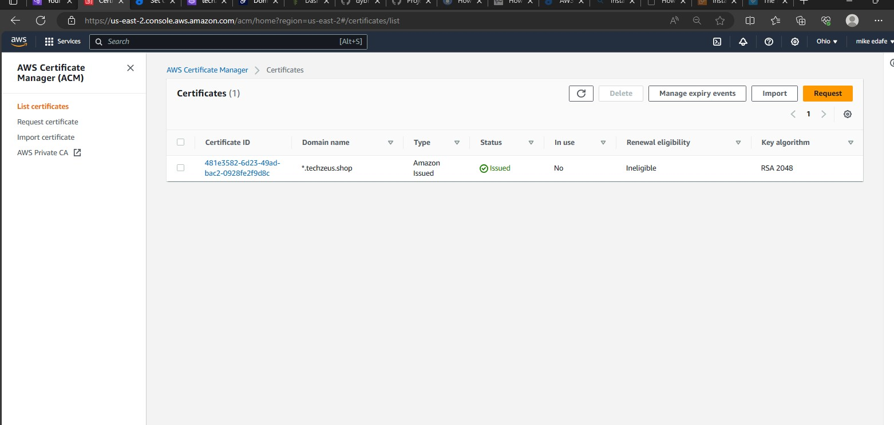

## PREREQUISITES

### Before starting off, you need to properly configure your AWS account and Organization unit using the steps below:

### Step 1:
```
- Create an AWS Master account. (Also known as Root Account)
- Within the Root account, create a sub-account and name it DevOps. (You will need another email address to complete this)
- Within the Root account, create an AWS Organization Unit (OU). Name it Dev. (We will launch Dev resources in there)
- Move the DevOps account into the Dev OU.
- Login to the newly created AWS account using the new email address.
```

### Step 2:
- Get a domain for your fictitious company

- Create a hosted zone in AWS, and map it to your free domain


### The diagram above is what will be implemented in this project.
- A client from the internet visits your domain name i.e mannzeus.shop, the traffic will go to route 53 which resolves the name to the DNS NAME of your ALB and route the traffic to ALB via the internet gateway of your VPC. i.e Route 53 resolves mannzeus.shop to the DNS name of your ALB and sends the traffic to your ALB

- The internet-facing ALB receives the traffic and forwards it to the Reverse-Proxy servers. The reverse-proxy servers will be configured to forward all received traffic to the internal ALB.

- Since you have 2 webservers serving 2 different websites behind the internal ALB, you will configure a rule for your internal ALB to check for host headers to enable it forward the match the right traffic to the right webserver. 
- The Host header will be configured in the Nginx Reverse-Proxy servers. You will set 2 rules , 1 will be the default rule saying "Forward all traffic to mannzeus.shop target". The 2nd Rule will be a condition saying "check the host headers, if it is tooling, forward traffic to the tooling server(target).
- Your webservers will be using the EFS to serve their content and storing data in database managed by RDS.

### Create a VPC, edit VPC settings and enable DNS hostnames.


### Create an internet gateway and attach to your VPC


### Create subnets, from your project diagram you are to create 2 public subnets and 4 private subnets IN 2 Availability Zones
```
10.0.1.0/24 public subnet 1 AZ A
10.0.2.0/24 public subnet 2 AZ B

10.0.3.0/24 private subnet 1 AZ A
10.0.4.0/24 private subnet 2 AZ B
10.0.5.0/24 private subnet 3 AZ A
10.0.6.0/24 private subnet 4 AZ B
```


### Create 2 route tables, a public and private route table and associate them to the public and private subnets respectively. Proceed to edit the routes, Edit a route in public route table, and associate it with the Internet Gateway. (This is what allows a public subnet to be accisble from the Internet)


### Create a NAT gateway in any of your public subnets and attach an elastic IP to it
### Create 2 bastion hosts, one in each AZ and attach elastic IPs to both

### Next you create security groups for the resources in your infrastructure 
- Security group for your external ALB: This accepts traffic from the whole internet so your inbound rule has to accept HTTPS and HTTP traffic from the anywhere.


- Security Group for the bastion server: Access to the Bastion servers should be allowed only from workstations that need to SSH into the bastion servers. Hence, you can use your workstation public IP address. To get this information, simply go to your terminal and type `curl www.canhazip.com`


- Security Group for the reverse proxy server: The reverse proxy only accepts traffic from the external ALB, thus it's inbound rule should allow HTTP AND HTTPS traffic only from the external ALB security group. You will need to make some configurations on the reverse proxy server thus, an inbound rule that allows SSH access from your bastion server to reverse proxy server should also be made


- Security Group for the internal ALB: This too accepts HTTP and HTTPS traffic only from the reverse proxy server  , create the rules accordingly


- Security Group for the webservers: Both webservers are in private subnets and accepts HTTP and HTTPS traffic only from the internal ALB and SSH traffic from your bastion. Thus create the rules accordingly

- Security Group for the Data layer: This layer is comprised of Amazon Relational Database Service (RDS) and Amazon Elastic File System (EFS) and must be carefully designed. The webservers should be able to connect to RDS and the EFS Mountpoint. The Bastion server also needs MySQL/Aurora administrative access to the database server.
A rule for MySQL/aurora access for the bastion is made
A rule for NFS access for the webservers is made
A rule for MySQL/aurora for the webservers is made


### Now that the seurity groups are created, get to creating the resources in your Infrastructure, create a certificate, an EFS and RDS.

### Go create a certificate

 
 ### Create your filesystem, set the mount targets to the specific subnets where your webservers will be located, in this case private subnet 1 and 2
 
 

 ### After creating the file systems, create access points, this is what the webservers mounts to the EFS with. Create 2 access points as you have 2 different websites
 

 ### Next Create your RDS, before creating your RDS you first need to create a KMS key from the KMS store and a subnet rule.

 ### First create a key to be used to encrypt the RDS
 

 ### Create a DB subnet group, choose the private subnets where the RDS is located in your infrastruture  
 

 ### Create the database with MySQL engine

 ### Next you need to create an ami to be used in creating the launch template. create 3 redhat instances: a webserver, a bastion and nginx
 
 
 ## PREPARE THE BASTION SERVER AMI

 ### Bastion ami installation
-------------------------------------
 ```
 sudo yum install https://dl.fedoraproject.org/pub/epel/epel-release-latest-9.noarch.rpm

yum install -y https://dl.fedoraproject.org/pub/epel/epel-next-release-latest-9.noarch.rpm

yum install -y dnf-utils http://rpms.remirepo.net/enterprise/remi-release-9.rpm

yum install wget vim python3 telnet htop git mysql net-tools chrony -y

systemctl start chronyd
systemctl enable chronyd
 ```

## PREPARE NGINX SERVER AMI

# Nginx ami installation 
-----------------------------------------

 sudo yum install -y https://dl.fedoraproject.org/pub/epel/epel-release-latest-9.noarch.rpm

yum install -y https://dl.fedoraproject.org/pub/epel/epel-next-release-latest-9.noarch.rpm

yum install -y dnf-utils http://rpms.remirepo.net/enterprise/remi-release-9.rpm

yum install wget vim python3 telnet htop git mysql net-tools chrony -y

systemctl start chronyd
systemctl enable chronyd

### configure selinux policies for the webservers and nginx servers to function properly
```
setsebool -P httpd_can_network_connect=1
setsebool -P httpd_can_network_connect_db=1
setsebool -P httpd_execmem=1
setsebool -P httpd_use_nfs 1
```

### Install amazon efs utils for mounting the target on the Elastic file system
```
git clone https://github.com/aws/efs-utils

cd efs-utils

yum install -y make

yum install -y rpm-build

make rpm 

yum install -y  ./build/amazon-efs-utils*rpm
```
### set up a self-signed certificate for the nginx instance
```
sudo mkdir /etc/ssl/private

sudo chmod 700 /etc/ssl/private

openssl req -x509 -nodes -days 365 -newkey rsa:2048 -keyout /etc/ssl/private/ACS.key -out /etc/ssl/certs/ACS.crt

sudo openssl dhparam -out /etc/ssl/certs/dhparam.pem 2048
```


## PREPARE THE WEBSERVER AMI

sudo yum install -y https://dl.fedoraproject.org/pub/epel/epel-release-latest-9.noarch.rpm

yum install -y https://dl.fedoraproject.org/pub/epel/epel-next-release-latest-9.noarch.rpm

yum install -y dnf-utils http://rpms.remirepo.net/enterprise/remi-release-9.rpm

yum install wget vim python3 telnet htop git mysql net-tools chrony -y

systemctl start chronyd
systemctl enable chronyd

### configure selinux policies for the webservers and nginx servers to function properly
```
setsebool -P httpd_can_network_connect=1
setsebool -P httpd_can_network_connect_db=1
setsebool -P httpd_execmem=1
setsebool -P httpd_use_nfs 1
```
### The webserver will host the websites using apache, so set up self-sogned certificate for the apache  webserver instance
```
yum install -y mod_ssl

openssl req -newkey rsa:2048 -nodes -keyout /etc/pki/tls/private/ACS.key -x509 -days 365 -out /etc/pki/tls/certs/ACS.crt

```
### For Nginx you specify the configuration in the `reverse.conf` file, but for apache, you edit the ssl/conf file. Look for the section where you specify the certificate path and the ssl key path
`vi /etc/httpd/conf.d/ssl.conf`


### Create images from the 3 instances


## Now create Target groups for the ALB. From the project diagram you can see that we have 3 sets of Target groups, the Nginx Target Group, the Wordpress server target groups and the Tooling server Target Groups. Thus you will be creating 2 target groups
- Select Instances as the target type
- Ensure the protocol HTTPS on secure TLS port 443
- Ensure that the health check path is /healthstatus
- Register Nginx Instances as targets
- Ensure that health check passes for the target group


### Create the Application Load Balancers next, both the External and Internal
When creating the Internal ALB you will set to set a rule to check for host headers and forward traffic to the appropriate target group.


https://github.com/NyerhovwoOnitcha/ACS/assets/101157174/148b278e-56cb-41ca-a4e5-72c4e8ebecd7


https://github.com/NyerhovwoOnitcha/ACS/assets/101157174/765648f3-006a-4471-834d-120c8b4529b2


### Next Create the launch Template and autoscaling group.
- Create launch template for the Bastion server, then the Nginx servers and finally the webservers (both) using the respective AMI's created before. 
- creating the launch template for the bastion server add the bootstrap text below
```
#!/bin/bash
yum install -y mysql
yum install -y git tmux
yum install -y ansible
```

- The launch template for Nginx server add the bootstrap text below
```
#!/bin/bash
yum install -y nginx
systemctl start nginx
systemctl enable nginx
git clone https://github.com/NyerhovwoOnitcha/ACS-project-config.git
mv ACS-project-config/reverse.conf /etc/nginx/
mv /etc/nginx/nginx.conf /etc/nginx/nginx.conf-distro
cd /etc/nginx/
touch nginx.conf
sed -n 'w nginx.conf' reverse.conf
systemctl restart nginx
rm -rf reverse.conf
rm -rf ACS-project-config
``` 
- creating the launch template for the wordpress server add the bootstrap text below

```
#!/bin/bash
mkdir /var/www/
sudo mount -t efs -o tls,accesspoint=fsap-0c70533c4f53656eb fs-032bc6a6ccf2c7769:/ /var/www/
yum install -y httpd 
systemctl start httpd
systemctl enable httpd
yum module reset php -y
yum module enable php:remi-7.4 -y
yum install -y php php-common php-mbstring php-opcache php-intl php-xml php-gd php-curl php-mysqlnd php-fpm php-json
systemctl start php-fpm
systemctl enable php-fpm
wget http://wordpress.org/latest.tar.gz
tar xzvf latest.tar.gz
rm -rf latest.tar.gz
cp wordpress/wp-config-sample.php wordpress/wp-config.php
mkdir /var/www/html/
cp -R /wordpress/* /var/www/html/
cd /var/www/html/
touch healthstatus
sed -i "s/localhost/techzeus-rds.c5szxeahybda.us-east-1.rds.amazonaws.com/g" wp-config.php 
sed -i "s/username_here/admin/g" wp-config.php 
sed -i "s/password_here/cnl12345/g" wp-config.php 
sed -i "s/database_name_here/wordpressdb/g" wp-config.php 
chcon -t httpd_sys_rw_content_t /var/www/html/ -R
systemctl restart httpd
```

- creating the launch template for the tooling server add the bootstrap text below
```

```
#!/bin/bash
mkdir /var/www/
sudo mount -t efs -o tls,accesspoint=fsap-0cd54a2a333905325 fs-032bc6a6ccf2c7769:/ /var/www/
yum install -y httpd 
systemctl start httpd
systemctl enable httpd
yum module reset php -y
yum module enable php:remi-7.4 -y
yum install -y php php-common php-mbstring php-opcache php-intl php-xml php-gd php-curl php-mysqlnd php-fpm php-json
systemctl start php-fpm
systemctl enable php-fpm
git clone https://github.com/NyerhovwoOnitcha/tooling.git
mkdir /var/www/html
cp -R /tooling-1/html/*  /var/www/html/
cd /tooling-1
mysql -h localhost/techzeus-rds.c5szxeahybda.us-east-1.rds.amazonaws.com -u admin -p toolingdb < tooling-db.sql
cd /var/www/html/
touch healthstatus
sed -i "s/$db = mysqli_connect('mysql.tooling.svc.cluster.local', 'admin', 'admin', 'tooling');/$db = mysqli_connect('acs-database.cdqpbjkethv0.us-east-1.rds.amazonaws.com', 'admin', 'cnl12345', 'toolingdb');/g" functions.php
chcon -t httpd_sys_rw_content_t /var/www/html/ -R
systemctl restart httpd


### Next create the Autoscaling groups. First create an autoscaling group for the bastion and nginx server


### Now you need to ssh into your bastion and from your bastion ssh into the RDS Database and create both the wordpressdb and the toolingdb

`mysql -h techzeus-rds.c5szxeahybda.us-east-1.rds.amazonaws.com -u admin -p`


### Create ASG for wordpress and tooling server


### Go back to route 53 and create A records to forward traffic to the External LoadBalancer


